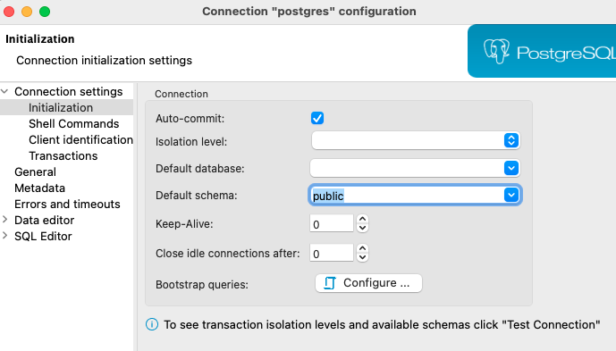
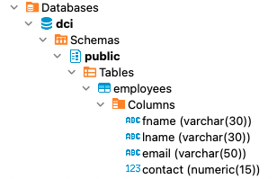

# Exercise # 3 - Create Tables

> **Ensure "Exercise # 2 - Manage Schema" is completed**

> **Start DBeaver tool and Establish a connection with the database named - DCI**
Mark "public" schema as the default.

> **Create a table named "Employees" with following details**
 
 | Column Name | Description | Data Type |
 |:--- | :--- | :---: |
 |fname|First Name|Character (30)|
 |lname|Last Name|Character (30)|
 |email|Email ID|Character (50)|
 |contact|Phone Number|Integer (15)|

***Hint:*** use CREATE TABLE command.

> **Refresh the list of tables under "public" schem and verify that "Employees" table is created**

=============================== Exercise ===================================

> **Start DBeaver tool and Establish a connection with the database named - DCI**
Mark "public" schema as the default.

> **Create a table named "Employees" with following details**

`CREATE TABLE Employees( fname varchar(30), lname varchar(30), email varchar(50), contact numeric(15,0));`

> **Refresh the list of tables under "public" schem and verify that "Employees" table is created**

