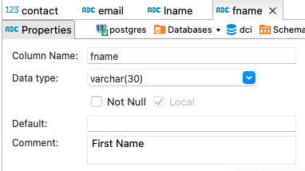

# Exercise # 4 - Add Comments to Table

> **Ensure "Exercise # 3 - Create Tables" is completed**

> **Start DBeaver tool and Establish a connection with the database named - DCI**
Mark "public" schema as the default.
Ensure "Employees" table exist.

> **Review the column defintions of the "Employees" table**
 
Note that description of the columns are missing as nothing is displayed as comment.

> **Add Decription of the column as comment to each column respectively in the Employees table**

***Hint:*** use the following command template.
```
COMMENT ON COLUMN <table_name>.<column_name> IS '<comment>';
```

> **Refresh the table view and review the column defintions. Note that comments are added to each column**

======================================================== Exercise ==================================================

> **Add Decription of the column as comment to each column respectively in the Employees table**

```
comment on column employees.fname  is 'First Name';
comment on column employees.lname  is 'Last Name';
comment on column employees.email  is 'Email';
comment on column employees.contact  is 'Contact';
```

> **Refresh the table view and review the column defintions. Note that comments are added to each column**



