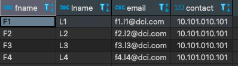

# Exercise # 2 - Modify All Employee Contacts

> **Ensure "Exercise # 1 - Add Employee Records" from DML Commands section is completed**

- Ensure "Employees" table exist.
- Ensure five records exist in this table.

> **Replace contact in all records of Employees table with a default value = 10101010101**

***Hint:*** Use UPDATE command.

> **Verify that each record of the Employees table has new contact value**

***Hint:*** Use SELECT * FROM command.

================================ Exercise ==========================

> **Replace contact in all records of Employees table with a default value = 10101010101**

`update employees set contact = 10101010101 where contact = 9900990099;`

> **Verify that each record of the Employees table has new contact value**

