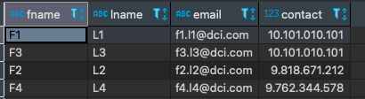

# Exercise # 3 - Modify Specific Records

> **Ensure "Exercise # 2 - Modify All Employee Contacts" from DML Commands section is completed**

- Ensure "Employees" table exist.
- Ensure five records exist in this table.

> **Replace contact in few records of Employees table as follows**

|email|contact|
|---|---|
|f2.l2@dci.com|9818671212|
|f4.l4@dci.com|9762344578|

***Hint:*** Use UPDATE command with WHERE clause.

> **Verify that given records of the Employees table have new contact values**

***Hint:*** Use SELECT * FROM command with WHERE clause.

=========================== Exercise ========================

> **Replace contact in few records of Employees table as follows**

```
update employees set contact = 9818671212 where email = 'f2.l2@dci.com';
update employees set contact = 9762344578 where email = 'f4.l4@dci.com';
```

> **Verify that given records of the Employees table have new contact values**


