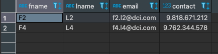

# Exercise # 4 - Remove Employees with Default Contact

> **Ensure "Exercise # 3 - Modify Specific Records" from DML Commands section is completed**

- Ensure "Employees" table exist.
- Ensure few records exist in this table with contact = 10101010101.

> **Remove records of Employees table with contact equals to 10101010101**

***Hint:*** Use DELETE command with WHERE clause.

> **Verify that given records of the Employees table have been removed**

***Hint:*** Use SELECT * FROM command with WHERE clause.

============================= Exercise ================================

> **Remove records of Employees table with contact equals to 10101010101**

`delete from employees where contact = 10101010101;`

> **Verify that given records of the Employees table have been removed**

