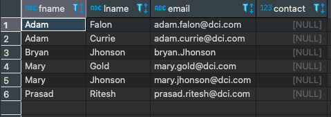
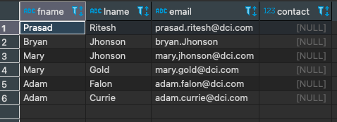

# Exercise # 3 - List Employees in a Sequence

> **Ensure "Exercise # 1 - Rebuild Employees Table" of DQL Section is complete.**

***Hint:*** The Employees table with 6 records shall exist.

> **List all Employee records as follows**

- First Name in *Ascending Order*, followed by
- Last Name in *Descending Order*
 
 ***Hint:*** Use SELECT command with ORDER BY clause. 
 
 ========================= Exercise ==========================
 
 > **List all Employee records as follows**

- First Name in *Ascending Order*

`select * from employees order by fname asc;`

- Last Name in *Descending Order*

`select * from employees order by lname desc;`

