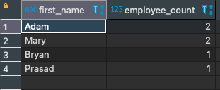

# Exercise # 4 - List Employee Count By FirstName

> **Ensure "Exercise # 1 - Rebuild Employees Table" of DQL Section is complete.**

***Hint:*** The Employees table with 6 records shall exist.

> **List all count of Employess grouped by the First Name as follows**

- fname  filed with label "First Name"
- Value of count with field label "Employee Count"
- "Employee Count" in *Descending Order*, followed by
- "First Name" in *Ascending Order*
 
 ***Hint:*** Use SELECT command with GROUP BY and ORDER BY clause. 

 > **Match with following result**

 |First Name|Employee Count|
 |---|---|
 |Adam|2|
 |Mary|2|
 |Bryan|1|
 |Prasad|1|
 
 ==================================== Exercise ===================================
 
 > **List all count of Employess grouped by the First Name as follows**

- fname  filed with label "First Name"
- Value of count with field label "Employee Count"
- "Employee Count" in *Descending Order*, followed by
- "First Name" in *Ascending Order*

```
select fname as First_Name, count(fname) as Employee_Count
from employees
group by fname
order by Employee_Count desc, fname asc;
```

 > **Match with following result**


